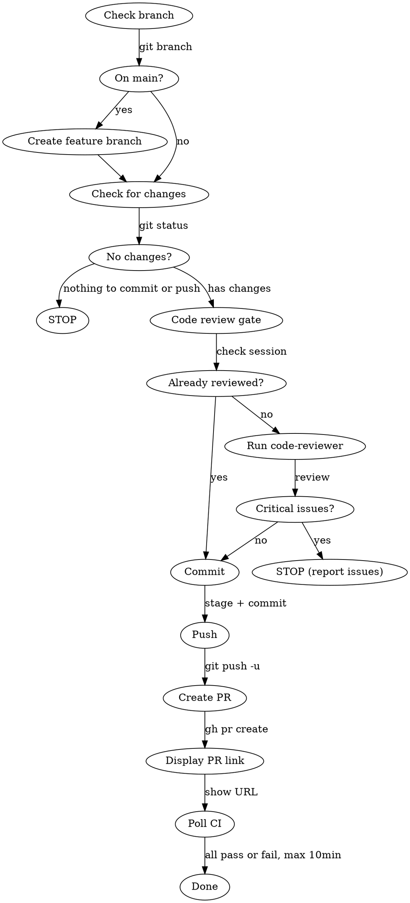

# Ship

Commits, pushes, creates a PR, and monitors CI — one command to ship your work.

## Workflow



## Instructions

### Step 1: Branch Check

Run `git branch --show-current`.

**If on `main` or `master`:**
- Ask user for branch name. Suggest format: `cbp-XXXXX-short-description` (extract ticket from conversation context if available).
- Run `git fetch origin main && git checkout -b <branch-name> origin/main`

**If already on a feature branch:**
- Continue.

### Step 2: Check for Changes

Run `git status` and `git diff --stat`.

- If there are uncommitted changes: proceed to Step 3.
- If there are NO uncommitted changes but commits exist ahead of origin: skip to Step 5 (push).
- If there are NO uncommitted changes AND no unpushed commits: run `gh pr view --json url,number` to check for existing PR. If PR exists, display its URL and skip to Step 7 (poll). If no PR and branch differs from main, skip to Step 6 (create PR). If branch does not differ from main, STOP — nothing to ship.

### Step 3: Code Review Gate

**Skip this step if a code-reviewer subagent has already run in this conversation.**

Otherwise, run the `code-reviewer` subagent on the pending changes. If critical issues are found, report them and STOP — do not commit.

### Step 4: Commit

1. Run `git log --oneline -5` to check recent commit style.
2. Extract Jira ticket from branch name (pattern: `cbp-XXXXX-*` → `CBP-XXXXX`).
3. Stage relevant files (prefer explicit file names over `git add .`).
4. Generate commit message:
   ```
   type(cbp-XXXXX): concise reason for the change

   Co-Authored-By: Claude <model-name> <noreply@anthropic.com>
   ```
   Where type is `fix`, `feat`, `chore`, or `test` as appropriate. Replace `<model-name>` with your actual model (e.g., `Opus 4.6`, `Sonnet 4.5`).
5. Commit using heredoc format. Use `dangerouslyDisableSandbox: true` (GPG signing needs `~/.gnupg`).

### Step 5: Push

Run `git push -u origin <branch-name>` with `dangerouslyDisableSandbox: true`.

### Step 6: Create PR

1. Extract Jira ticket from branch name for linking.
2. Run `git log origin/main..HEAD --oneline` to see all commits being shipped.
3. Create PR with `gh pr create`:
   ```
   gh pr create --title "<commit-style title>" --body "$(cat <<'EOF'
   ## Summary
   <1-3 bullet points summarizing the change>

   Jira: [CBP-XXXXX](https://cloudbees.atlassian.net/browse/CBP-XXXXX)

   ## Test plan
   - [ ] CI passes
   <additional test steps if relevant>

   🤖 Generated with [Claude Code](https://claude.com/claude-code)
   EOF
   )"
   ```
4. Use `dangerouslyDisableSandbox: true` for `gh` commands. If `gh` fails with TLS errors, use the curl fallback:
   ```bash
   TOKEN=$(gh auth token)
   REPO=$(gh repo view --json nameWithOwner -q .nameWithOwner)
   curl -sSf -x http://localhost:57765 -k \
     -H "Authorization: token $TOKEN" \
     -H "Accept: application/vnd.github+json" \
     -X POST "https://api.github.com/repos/$REPO/pulls" \
     -d '{"title":"...","body":"...","head":"<branch>","base":"main"}'
   ```
5. **Display the PR URL prominently to the user.**

### Step 7: Poll CI Checks

Run `gh pr checks <number> --json "name,state,description,link"` immediately.

**Polling mechanism:**
1. Check status immediately after PR creation.
2. If any checks are still `PENDING`, run the next check as a background command: `sleep 30 && gh pr checks <number> --json "name,state,description,link"` with `run_in_background: true`.
3. When the background command completes, check the result. If still pending, launch another background check. Repeat up to 20 times (10 minutes total).
4. Do NOT block the user — they can continue working while checks run.

**Reporting logic:**
- If ALL checks have state `SUCCESS`: report "All CI checks passed" and stop.
- If ANY check has state `FAILURE` or `ERROR`: report the failing check(s) with name, description, and link. Stop.
- If still `PENDING` after 10 minutes: report current status of each check and stop.

When reporting final status, include:
- Each check name and result
- Link to failing check if available

## Important Notes

- **NEVER commit to main/master directly** — always create a feature branch.
- **NEVER force push** — if push fails, report the error and stop. If the failure is due to a diverged remote, suggest `git pull --rebase origin <branch>` as a recovery step.
- Prefer explicit file staging over `git add .` to avoid committing secrets or binaries.
- If no Jira ticket can be extracted from branch name (or from `$ARGUMENTS`), ask the user for it.
- Commit message explains WHY, not WHAT.
- Do not rebase during ship. If branch is behind main, inform user but proceed.
- This skill assumes manual code review has already been done. It does NOT open GoLand or gate on user approval before commit.
